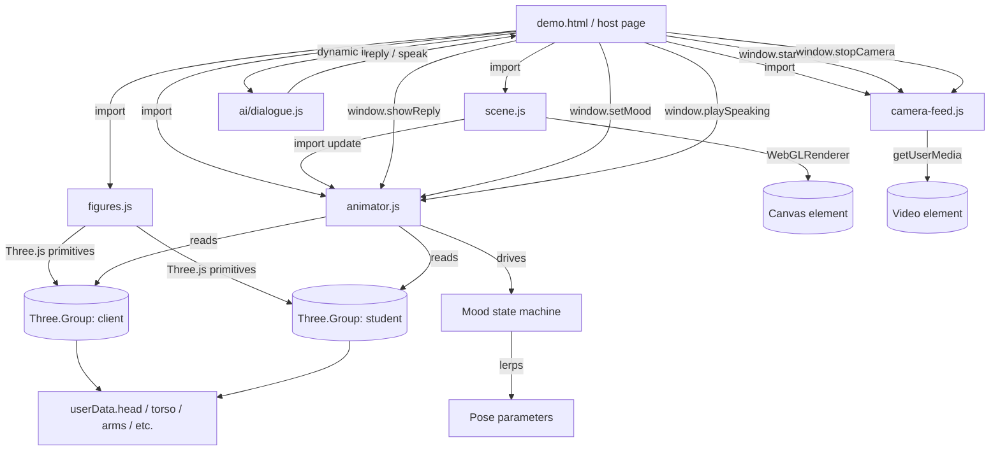
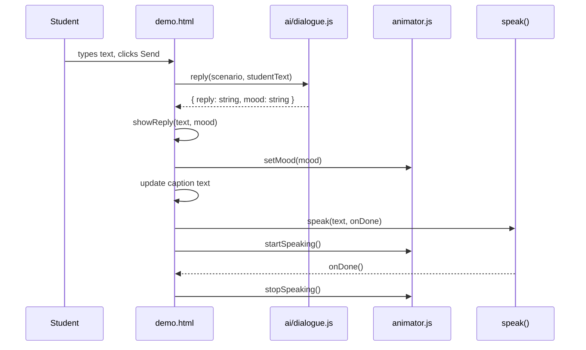
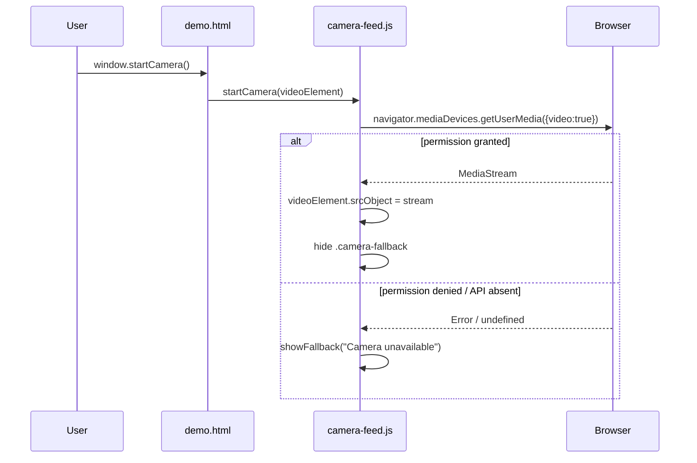

# Design Document: Virtual Client 3D Scene

## Overview

The Virtual Client 3D Scene (M3) is the interaction and rendering layer of the Virtual Client web app. It renders two figurines in a Three.js WebGL canvas, drives six distinct mood states on the client figurine through a smooth animation state machine, streams the student's webcam feed into a mirrored panel, and exposes a small public API (`window.*`) that lets the AI dialogue engine (M4) and the main integrator (M1) control mood, captions, and speaking animation.

The module is deliberately self-contained: no bundler, no TypeScript, no external CSS framework. Every file is a plain ES module that loads Three.js from a pinned CDN URL. The `demo.html` page doubles as a standalone test harness. A Playwright verification script (`verify.js`) captures seven PNG screenshots -- one per mood plus speaking -- to prove the state machine works without a live AI engine.

The module integrates with `ai/dialogue.js` (owned by M4) via two named imports -- `reply()` and `speak()` -- but degrades gracefully if that file is absent or throws.

---

## Architecture



### Module Responsibilities

| Module | Responsibility |
|--------|---------------|
| `scene.js` | WebGLRenderer, camera, lighting, resize handler, rAF loop |
| `figures.js` | Geometry construction, palette configuration, `userData` wiring |
| `animator.js` | Mood state machine, idle oscillations, speaking gestures, lerp transitions |
| `camera-feed.js` | `getUserMedia` lifecycle, graceful fallback |
| `demo.html` | Bootstrap, public API (`window.*`), test harness UI |
| `verify.js` | Playwright screenshot runner, local static server |

---

## Sequence Diagrams

### Conversation Turn Flow



### Mood Transition Flow

```mermaid
sequenceDiagram
    participant Caller
    participant Anim as animator.js
    participant Loop as rAF loop

    Caller->>Anim: setMood("angry")
    Anim->>Anim: snapshot current params as 'previous'
    Anim->>Anim: load MOOD_PARAMS["angry"] as 'target'
    Anim->>Anim: transitionProgress = 0.0

    Loop->>Anim: update(delta) x N frames
    Anim->>Anim: transitionProgress += delta / 0.3
    Anim->>Anim: current[k] = lerp(previous[k], target[k], t)
    Anim->>Anim: applyClientPose()

    Note over Anim: after ~0.3s, t=1.0, transition done
```

### Camera Start Flow



---

## Components and Interfaces

### scene.js

**Purpose**: Owns the WebGL context, camera, lighting, and the single `requestAnimationFrame` loop.

**Interface**:
```javascript
// Attach renderer to canvas, create scene + camera + lights
initScene(canvasElement: HTMLCanvasElement): void

// Start the rAF render loop (calls animatorUpdate each frame)
startLoop(): void

// Cancel the rAF loop
stopLoop(): void

// Getters for external modules that need scene/camera/renderer
getScene(): THREE.Scene
getCamera(): THREE.PerspectiveCamera
getRenderer(): THREE.WebGLRenderer
```

**Responsibilities**:
- Create `THREE.WebGLRenderer` with `antialias: true`, `alpha: false`
- Set scene background to `#F7F4EC`
- Place camera at `(0, 1.8, 7)` looking at `(0, 1.2, 0)` for slight downward angle
- Add one `AmbientLight(0xffffff, 0.65)` and one `DirectionalLight(0xffffff, 0.85)` at `(2, 5, 4)` -- no colored lights
- Handle `window.resize` to keep aspect ratio correct
- Cap frame delta at 100ms to avoid animation jumps after tab focus loss

---

### figures.js

**Purpose**: Constructs the two figurines from Three.js primitives. No animation logic here.

**Interface**:
```javascript
// Returns a THREE.Group for the AI-driven client figurine (left side)
createClientFigure(): THREE.Group

// Returns a THREE.Group for the student stand-in figurine (right side)
createStudentFigure(): THREE.Group
```

Each returned group exposes named parts on `group.userData`:

```javascript
// userData structure on every figure group
{
  head:      THREE.Mesh,   // sphere, drives rotation/tilt
  torso:     THREE.Mesh,   // cylinder, drives scale.y (breathing), rotation.x (lean)
  leftArm:   THREE.Group,  // drives rotation.z (spread/retract), rotation.x (raise)
  rightArm:  THREE.Group,
  leftLeg:   THREE.Group,
  rightLeg:  THREE.Group,
  leftEye:   THREE.Mesh,   // sphere, drives scale.y (wide/narrow)
  rightEye:  THREE.Mesh,
  leftBrow:  THREE.Mesh,   // box, drives position.y and rotation.z
  rightBrow: THREE.Mesh,
  mouth:     THREE.Mesh,   // box, drives scale.y (open height) and scale.x (width)
}
```

**Responsibilities**:
- Keep polygon count under 500 per figure (use 8x6 sphere, 8-segment cylinder)
- Use `MeshLambertMaterial` (not `MeshStandardMaterial`) for flat, no-glow shading
- Wire all named `userData` references before returning
- Client: dark slate/navy torso (`#2C3E50`), warm neutral skin (`#D4A574`), rotated 15 degrees inward
- Student: muted dark green torso (`#4A6741`), slightly different skin, mirrored inward rotation

---

### animator.js

**Purpose**: Drives all time-based animation. Owns the mood state machine and speaking flag.

**Interface**:
```javascript
// Call once after figures are added to scene
initAnimator(clientFigure: THREE.Group, studentFigure: THREE.Group): void

// Called every frame by scene.js
update(deltaSeconds: number): void

// Switch client mood (with smooth 0.3s lerp transition)
setMood(mood: 'calm'|'anxious'|'angry'|'sad'|'happy'|'confused'): void

// Activate talking gestures and mouth open/close
startSpeaking(): void

// Deactivate talking gestures
stopSpeaking(): void
```

**Mood parameters** (all values lerped during transition):

| Parameter | Role |
|-----------|------|
| `idlePeriod` | Seconds per sway cycle |
| `idleAmplitude` | Max Z-rotation for idle sway (radians) |
| `forwardLean` | Torso X-rotation (0 = upright, +0.22 = aggressive lean) |
| `headTilt` | Head Z-rotation (confused side-tilt, sad drop) |
| `shoulderDrop` | Arm Y-position offset (sad slump) |
| `bounceAmplitude` | Happy Y-bounce magnitude |
| `browLeftY/browRightY` | Brow vertical offset |
| `browLeftRot/browRightRot` | Brow Z-rotation (V-shape for angry, arch for sad) |
| `eyeScale` | Eye Y-scale (1.25 = wide/anxious, 0.7 = narrow/angry) |
| `mouthScaleX` | Mouth width (1.3 = smile, 0.8 = confused sideways) |
| `mouthHeight` | Mouth base height in scene units |
| `armRaise` | Arm Z-rotation for spread/retract |

**Responsibilities**:
- Maintain a single `time` accumulator for oscillation
- Lerp all parameters from `previous` to `target` over `TRANSITION_DURATION = 0.3s`
- Speaking mouth: sine-wave `(sin(2pi * t / 0.25) + 1) / 2` adds up to 0.07 extra height
- Breathing: torso `scale.y` oscillates `1.0 to 1.02` on a 3.5s period
- Confused mood special case: raise right arm toward chin when not speaking
- Student figure: independent gentle sway (5s period, phase-offset) plus breathing only

---

### camera-feed.js

**Purpose**: Manages the student's webcam stream. No Three.js dependency.

**Interface**:
```javascript
// Request getUserMedia and stream to <video>. Never throws -- falls back gracefully.
startCamera(videoElement: HTMLVideoElement): Promise<void>

// Stop all tracks and clear srcObject
stopCamera(videoElement: HTMLVideoElement): void
```

**Responsibilities**:
- Request `{ video: true, audio: false }` only
- Apply mirror via CSS `transform: scaleX(-1)` on the `<video>` element (set in CSS, not JS)
- On success: `videoElement.srcObject = stream`, hide `.camera-fallback`
- On failure: call `showFallback(videoElement, 'Camera unavailable')`, never `alert()` or throw
- Check for `navigator.mediaDevices` before calling (Safari private mode guard)
- On `stopCamera()`: stop all tracks, clear `srcObject`, show fallback again

---

## Data Models

### MoodParams

```javascript
// All fields are Numbers (floating-point)
MoodParams = {
  idlePeriod:      Number,  // seconds, > 0
  idleAmplitude:   Number,  // radians, >= 0
  forwardLean:     Number,  // radians (can be negative for slight backward lean)
  headTilt:        Number,  // radians
  shoulderDrop:    Number,  // scene units
  bounceAmplitude: Number,  // scene units
  browLeftY:       Number,  // scene units, offset from neutral
  browRightY:      Number,  // scene units
  browLeftRot:     Number,  // radians
  browRightRot:    Number,  // radians
  eyeScale:        Number,  // multiplier on Y scale (1.0 = default)
  mouthScaleX:     Number,  // multiplier on X scale (1.0 = default)
  mouthHeight:     Number,  // scene units, base closed height
  armRaise:        Number,  // radians, Z rotation
}
```

**Validation rules**:
- `idlePeriod` must be > 0 (divide-by-zero guard in oscillation formula)
- `eyeScale` should stay in `[0.5, 1.5]` range to remain readable
- `mouthHeight` should be > 0 to keep mouth geometry visible

### Figure UserData

```javascript
// Attached to root THREE.Group by buildFigure()
FigureUserData = {
  head:      THREE.Mesh,
  torso:     THREE.Mesh,
  leftArm:   THREE.Group,
  rightArm:  THREE.Group,
  leftLeg:   THREE.Group,
  rightLeg:  THREE.Group,
  leftEye:   THREE.Mesh,
  rightEye:  THREE.Mesh,
  leftBrow:  THREE.Mesh,
  rightBrow: THREE.Mesh,
  mouth:     THREE.Mesh,
}
```

### AI Dialogue Contract

```javascript
// Expected exports from ai/dialogue.js (M4 owns this)
reply(scenario: string, studentText: string): Promise<{ reply: string, mood: MoodName }>
speak(text: string, onDone: () => void): void

// MoodName is one of:
type MoodName = 'calm' | 'anxious' | 'angry' | 'sad' | 'happy' | 'confused'
```

---

## Algorithmic Pseudocode

### Main Render / Animation Update

```pascal
ALGORITHM update(delta)
INPUT: delta -- elapsed seconds since last frame (capped at 0.1)
OUTPUT: side effects on Three.js scene graph

BEGIN
  time <- time + delta

  // Advance mood transition
  IF transitionProgress < 1.0 THEN
    transitionProgress <- MIN(transitionProgress + delta / TRANSITION_DURATION, 1.0)
    FOR each key IN keys(target) DO
      current[key] <- lerp(previous[key], target[key], transitionProgress)
    END FOR
  END IF

  applyClientPose()
  applyStudentPose()
END
```

### Mood Transition State Machine

```pascal
ALGORITHM setMood(mood)
INPUT: mood -- string key into MOOD_PARAMS
PRECONDITION: MOOD_PARAMS contains key mood
POSTCONDITION: transition has started, current state unchanged until next update()

BEGIN
  IF mood NOT IN MOOD_PARAMS THEN
    mood <- 'calm'
    LOG warning("Unknown mood, falling back to calm")
  END IF

  IF mood = currentMood THEN RETURN END IF   // no-op if already in this mood

  currentMood <- mood
  previous <- copy of current         // snapshot lerp start point
  target <- copy of MOOD_PARAMS[mood] // lerp destination
  transitionProgress <- 0.0           // kick off 0.3s transition
END
```

**Loop invariant for the lerp loop in `update()`**:
- At the start of each frame, all keys in `current` are valid numbers in plausible ranges
- After the lerp step, each `current[key]` lies strictly between `previous[key]` and `target[key]` while `transitionProgress` is in `(0, 1)`, and equals `target[key]` when `transitionProgress = 1`

### Idle Oscillation

```pascal
ALGORITHM computeIdleSway(time, idlePeriod, idleAmplitude)
INPUT: time (seconds), idlePeriod (seconds > 0), idleAmplitude (radians >= 0)
OUTPUT: sway -- rotation in radians

BEGIN
  phase <- (2 * PI / idlePeriod) * time
  sway  <- sin(phase) * idleAmplitude
  RETURN sway
END
```

**Preconditions**:
- `idlePeriod > 0` (prevents division by zero)
- `idleAmplitude >= 0`

**Postconditions**:
- Returns value in `[-idleAmplitude, +idleAmplitude]`

### Speaking Mouth Open/Close

```pascal
ALGORITHM computeMouthOpen(time, baseMouthHeight, isSpeaking)
INPUT: time (seconds), baseMouthHeight (scene units > 0), isSpeaking (boolean)
OUTPUT: mouthOpen -- scene units for mouth geometry Y scale base

BEGIN
  mouthOpen <- baseMouthHeight

  IF isSpeaking THEN
    talkPhase <- (2 * PI / 0.25) * time   // 0.25s period (4Hz)
    openFactor <- (sin(talkPhase) + 1) / 2 // 0.0 to 1.0
    mouthOpen  <- baseMouthHeight + openFactor * 0.07
  END IF

  RETURN mouthOpen
END
```

**Preconditions**:
- `baseMouthHeight > 0`

**Postconditions**:
- When not speaking: returns `baseMouthHeight`
- When speaking: returns value in `[baseMouthHeight, baseMouthHeight + 0.07]`
- Never returns 0 or negative (geometry degeneracy guard)

### Breathing Oscillation

```pascal
ALGORITHM computeBreathing(time)
INPUT: time (seconds)
OUTPUT: scaleY -- torso Y scale

BEGIN
  breathPhase <- (2 * PI / 3.5) * time   // 3.5s period
  scaleY      <- 1.0 + sin(breathPhase) * 0.01
  RETURN scaleY
END
```

**Postconditions**:
- Returns value in `[0.99, 1.01]`, centered on 1.0
- Never zero (safe to assign to `scale.y`)

---

## Key Functions with Formal Specifications

### initScene(canvasElement)

**Preconditions**:
- `canvasElement` is a valid `HTMLCanvasElement` already in the DOM
- Called only once per page lifetime

**Postconditions**:
- `renderer` has `canvas === canvasElement`
- `scene.background` equals `THREE.Color(0xF7F4EC)`
- `camera.position` is `(0, 1.8, 7)` and looking at `(0, 1.2, 0)`
- Scene contains exactly 2 lights (1 ambient, 1 directional)
- `window.resize` event listener is registered

### startLoop()

**Preconditions**:
- `initScene()` has been called
- `initAnimator()` has been called

**Postconditions**:
- A `requestAnimationFrame` loop is active
- Each frame calls `animatorUpdate(delta)` then `renderer.render(scene, camera)`
- `delta` is capped at 0.1s

**Loop invariant**:
- `renderer`, `scene`, `camera` references remain stable across frames

### createClientFigure() / createStudentFigure()

**Preconditions**: None (factory functions, no side effects)

**Postconditions**:
- Returns a `THREE.Group` with all 11 `userData` references populated (non-null)
- Total mesh polygon count per group is under 500 triangles
- Root group position is `(-1.4, 0, 0)` for client, `(1.4, 0, 0)` for student
- All materials are `MeshLambertMaterial` (no `MeshStandardMaterial` or emissive)

### startCamera(videoElement)

**Preconditions**:
- `videoElement` is a valid `HTMLVideoElement`

**Postconditions**:
- On success: `videoElement.srcObject` is a live `MediaStream`, video plays, fallback hidden
- On any failure (denied, unsupported): fallback text shown, no exception propagated
- No `alert()` or `throw` under any code path

---

## Example Usage

### Embedding the scene in the main app

```javascript
// In the host page (plain ES module)
import { initScene, startLoop, getScene } from './scene/scene.js';
import { createClientFigure, createStudentFigure } from './scene/figures.js';
import { initAnimator, setMood, startSpeaking, stopSpeaking } from './scene/animator.js';
import { startCamera } from './scene/camera-feed.js';

const canvas = document.querySelector('#my-canvas');
initScene(canvas);

const sceneGraph = getScene();
const client = createClientFigure();
const student = createStudentFigure();
sceneGraph.add(client);
sceneGraph.add(student);

initAnimator(client, student);
startLoop();

// Wire up AI dialogue integration
const { reply, speak } = await import('../ai/dialogue.js');

async function onStudentSend(scenario, studentText) {
  const { reply: text, mood } = await reply(scenario, studentText);
  setMood(mood);
  startSpeaking();
  speak(text, () => stopSpeaking());
}
```

### Using the public API from a parent frame

```javascript
// From the parent page or browser console
window.setMood('anxious');
window.showReply("I'm worried this breach will affect our clients.", 'anxious');
window.playSpeaking(2000);
window.startCamera();
window.stopCamera();
```

### Test mode (no AI engine)

When `ai/dialogue.js` is missing, `demo.html` shows a banner and uses keyword-based mood detection for the test harness:

```javascript
// Internal test-mode fallback in demo.html
const lower = studentText.toLowerCase();
if (lower.includes('angry')) mood = 'angry';
else if (lower.includes('sad')) mood = 'sad';
// ...
const reply = '[AI engine not connected -- running in test mode]';
window.showReply(reply, mood);
```

---

## Correctness Properties

*A property is a characteristic or behavior that should hold true across all valid executions of a system — essentially, a formal statement about what the system should do. Properties serve as the bridge between human-readable specifications and machine-verifiable correctness guarantees.*

### Property 1: Mood completeness

For every mood name in `['calm', 'anxious', 'angry', 'sad', 'happy', 'confused']`, `MOOD_PARAMS[mood]` exists and all its numeric fields are finite numbers.

**Validates: Requirements 1.1**

### Property 2: Transition interpolation invariant

After `setMood(m)`, for any frame while `transitionProgress` is in `(0, 1)`, every `current[k]` lies strictly between `previous[k]` and `target[k]` (no snapping); and once `transitionProgress` reaches `1.0`, every `current[k]` equals `target[k]`.

**Validates: Requirements 1.2, 1.5, 1.6**

### Property 3: No-op guard

Calling `setMood(m)` when `m === currentMood` does not restart the transition — `transitionProgress` remains unchanged and no new snapshot is taken.

**Validates: Requirements 1.3**

### Property 4: Unknown mood graceful fallback

For any string that is not one of the six valid mood names, calling `setMood()` with that string logs a warning, substitutes `'calm'` as the target, and never throws an error or enters an undefined state.

**Validates: Requirements 1.4**

### Property 5: Mouth positivity and speaking range

For any `baseMouthHeight > 0` and any elapsed time `t >= 0`, `computeMouthOpen(t, baseMouthHeight, isSpeaking)` always returns a value strictly greater than `0`. When `isSpeaking` is true, the return value lies in `[baseMouthHeight, baseMouthHeight + 0.07]`; when false it equals `baseMouthHeight`.

**Validates: Requirements 2.1, 2.2**

### Property 6: Camera no-throw

For any browser environment — including absence of `navigator.mediaDevices`, permission denial, or any runtime error from `getUserMedia` — `startCamera()` always resolves (never rejects or throws) and never calls `alert()`.

**Validates: Requirements 3.2, 3.5**

### Property 7: Speaking stop idempotent

Calling `stopSpeaking()` any number of times with no intervening `startSpeaking()` produces no state corruption and throws no errors; subsequent calls are identical in effect to the first call.

**Validates: Requirements 2.4**

### Property 8: Frame rate independence

For any sequence of `delta` values that sum to the same total elapsed time `T`, the final animated pose after applying all `update(delta)` calls is identical regardless of how many frames (i.e., how large or small each `delta` is), because all animation increments are computed relative to `delta`.

**Validates: Requirements 4.4**

### Property 9: Figure userData completeness

For any call to `createClientFigure()` or `createStudentFigure()`, the returned `THREE.Group` has all eleven `userData` references (`head`, `torso`, `leftArm`, `rightArm`, `leftLeg`, `rightLeg`, `leftEye`, `rightEye`, `leftBrow`, `rightBrow`, `mouth`) populated as non-null objects.

**Validates: Requirements 5.2**

### Property 10: Figure material exclusivity

For every mesh in a figure group returned by `createClientFigure()` or `createStudentFigure()`, the material is an instance of `MeshLambertMaterial`; no `MeshStandardMaterial` or emissive material property is used.

**Validates: Requirements 5.4**

### Property 11: XSS prevention via textContent

For any string assigned as AI reply text (including strings containing HTML tags, script elements, or event-handler attributes), the Public_API inserts the text exclusively via `element.textContent`, ensuring the string is rendered as literal characters and not parsed as HTML.

**Validates: Requirements 6.2, 6.6**

### Property 12: Keyword mood detection covers valid moods

For any student input string containing a recognized mood keyword (e.g., `"angry"`, `"sad"`, `"happy"`, `"anxious"`, `"confused"`), the Fallback_Mode keyword detector returns a valid mood name from the six-element set; no input string causes it to return an undefined or invalid mood.

**Validates: Requirements 7.3**

---

## Error Handling

### WebGL unavailable

**Condition**: Browser does not support WebGL or context creation fails.

**Response**: `THREE.WebGLRenderer` constructor will throw. The host page should catch this and show a plain-text fallback message ("Your browser does not support WebGL. Please use Chrome or Edge.").

**Recovery**: No automatic recovery -- inform the user.

---

### ai/dialogue.js missing

**Condition**: Dynamic `import('../ai/dialogue.js')` rejects (file absent or syntax error).

**Response**: `demo.html` catches the rejection, sets `dialogueEngine = null`, and shows mode note: "AI engine not connected -- running in test mode."

**Recovery**: Test harness remains fully functional with keyword-based mood simulation.

---

### speak() callback never fires

**Condition**: TTS silently fails to trigger `onDone`.

**Response**: `showReply()` falls back to `setTimeout` estimated from text length (`text.length * 60ms`, min 1s) when no dialogue engine is connected. When the engine IS connected, if `onDone` never fires, `stopSpeaking()` is never called -- this is an M4 responsibility to fix on their side.

**Mitigation**: M3 could add a safety timeout (e.g. `text.length * 80ms + 2000ms`) to call `stopSpeaking()` if `onDone` has not fired. Not currently implemented; tracked as a known limitation.

---

### Camera permission denied mid-session

**Condition**: User revokes camera permission after stream was granted.

**Response**: The browser terminates the track. The `<video>` element will freeze on last frame. `stopCamera()` should be called to clean up and show fallback.

**Recovery**: User can call `window.startCamera()` again after re-granting permission.

---

## Testing Strategy

### Unit Testing Approach

Each module can be tested in isolation by importing it into a Node.js test runner (e.g., Vitest) with a lightweight Three.js stub:

- `animator.js`: inject mock figure objects with `userData`, call `update(delta)` multiple times, assert that `rotation.z`, `scale.y`, etc. approach expected values
- `figures.js`: assert that returned groups have all 11 `userData` keys populated and are non-null
- `camera-feed.js`: mock `navigator.mediaDevices` -- assert no throws on denial, assert `srcObject` set on success

### Property-Based Testing Approach

**Property test library**: `fast-check`

Key properties to fuzz:
- `setMood(anyString)` never throws (unknown moods fall back to calm)
- `update(delta)` for any `delta` in `[0, 0.1]` never produces NaN in pose fields
- After N frames with any sequence of `setMood()` calls, all pose values are finite numbers
- `computeMouthOpen(t, h, speaking)` for any `t >= 0` and `h > 0` returns a positive number

### Integration Testing Approach (verify.js)

The Playwright script `verify.js` provides end-to-end visual regression:

1. Starts a local HTTP server serving the repo root
2. Opens `demo.html` in headless Chromium (1100x700 viewport)
3. Waits 1.5s for scene initialization and first render
4. For each of 6 moods: calls `window.setMood(mood)`, waits 800ms, captures screenshot
5. Calls `window.playSpeaking(2000)`, waits 500ms, captures speaking screenshot
6. Saves 7 PNGs to `scene/_verify/`

Expected output files:
- `calm.png`, `anxious.png`, `angry.png`, `sad.png`, `happy.png`, `confused.png`, `speaking.png`

---

## Performance Considerations

- **Single rAF loop**: `scene.js` owns the single `requestAnimationFrame` loop. No other module should call `rAF`.
- **Geometry disposal**: `buildFigure()` creates geometries and materials once at startup. No runtime geometry allocation. If figures are ever destroyed, call `geometry.dispose()` and `material.dispose()` to prevent GPU memory leaks.
- **Polygon budget**: 8-segment spheres and cylinders keep each figure well under 500 triangles. `MeshLambertMaterial` (no PBR) is cheaper to shade than `MeshStandardMaterial`.
- **Delta cap**: `delta` is capped at 100ms in `scene.js` to prevent large position jumps after the tab loses focus.
- **Target frame rate**: 60fps on mid-range hardware (Chrome/Edge). No post-processing effects, no shadows, no environment maps.
- **Resize handling**: Canvas is resized on `window.resize` only (event-driven, not per-frame).

---

## Security Considerations

- **Camera permission**: The app requests only `{ video: true, audio: false }`. No audio capture.
- **No data transmission**: The webcam feed never leaves the browser. `camera-feed.js` only writes to a `<video>` element's `srcObject`.
- **CDN integrity**: Three.js is loaded from `cdn.jsdelivr.net` at a pinned version (`three@0.161.0`). Consider adding a `<script integrity="sha384-...">` attribute in production to guard against CDN supply chain attacks.
- **AI content**: Reply text from `ai/dialogue.js` is inserted as `element.textContent` (not `innerHTML`) in the caption, preventing XSS.
- **No eval / dynamic code**: No `eval()`, `new Function()`, or `innerHTML` with AI content anywhere in M3.

---

## Dependencies

| Dependency | Version | Purpose | Load Method |
|------------|---------|---------|-------------|
| Three.js | 0.161.0 (pinned) | 3D renderer, geometry, materials | CDN import (`https://cdn.jsdelivr.net/npm/three@0.161.0/build/three.module.js`) |
| Playwright | latest | Verification screenshots only | Node.js devDependency (`node scene/verify.js`) |
| ai/dialogue.js | M4-owned | `reply()` and `speak()` integration | Dynamic `import('../ai/dialogue.js')` |

No bundler. No TypeScript. No CSS framework. No other dependencies.
